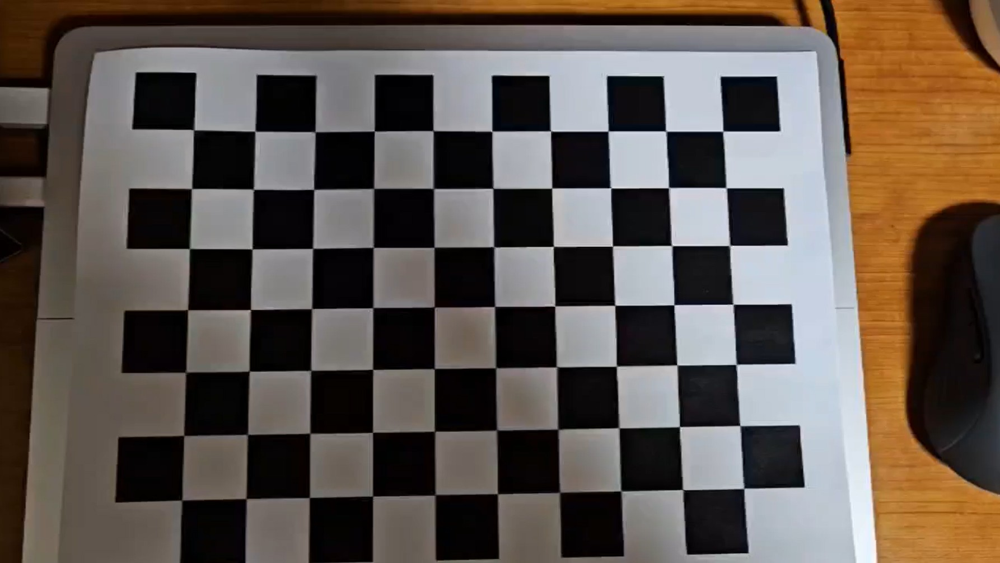
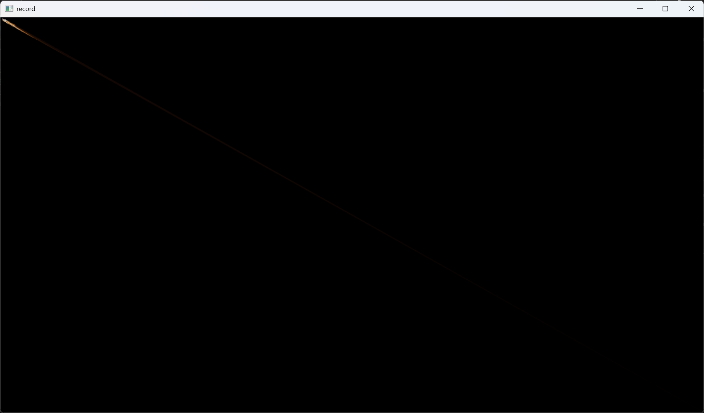

# cv_camera_cali_and_distort
Camera calibration example and so distortion correct

## Result

RMSE: 0.448297
Distortion coefficient (k1, k2, p1, p2, k3 ...): [0.2319312814294019, -4.133235939041602, 0.00254585949211152, 0.007092331493671674, 21.51409719800601]
K [998.0130764328934, 0, 420.978408727272643, 0, 1001.272688293928, 204.1115496365296, 0, 0, 1]

Original

Result
