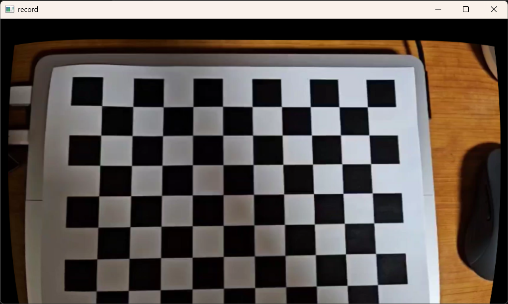

# cv_camera_cali_and_distort
Camera calibration example and so distortion correct

## Result

RMSE: 0.48504
Distortion coefficient (k1, k2, p1, p2, k3 ...): [0.02117044561832493, -0.4064978943393573, -0.0003930054408396876, 0.00399327579134816, 1.371591217276172]
K [1215.378330084007, 0, 0, 0, 1214.978372283301, 0, 614.4103822758433, 311.1955005872432, 1]

Original

Result
